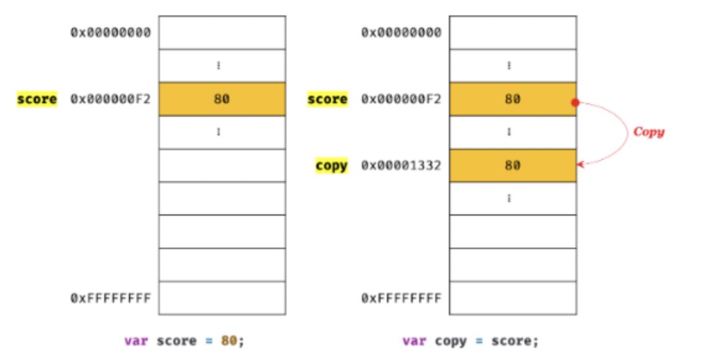
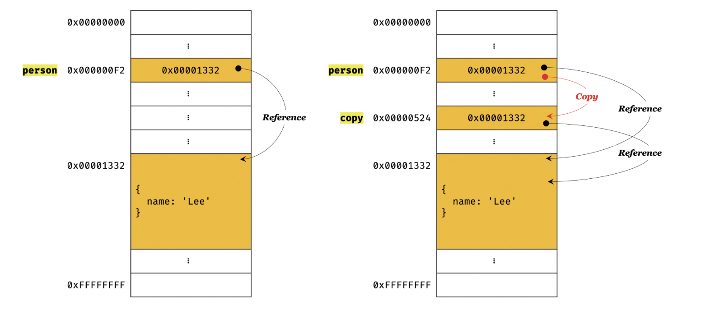

# 11장 원시 값과 객체의 비교

자바스크립트가 제공하는 7가지 데이터 타입(숫자, 문자열, 불리언, null, undefined, 심벌, 객체타입)은 크게 **원시 타입** 과 **객체 타입**으로 구분 할 수 있다.

<br/>

> 원시 타입과 객체 타입의 차이점

1. 원시 값은 **변경 불가능한 값**이고 객체는 **변경 가능한 값**이다.
2. 원시 값을 변수에 할당하면 변수에는 **실제 값**이 저장되고, 객체를 변수에 할당하면 **참조 값**이 저장된다.
3. 원시 값은 다른 변수에 할당하면 원본의 원시 값이 복사되어 전달되고, 이를 **값에 의한 전달**이라 한다.  
   객체를 다른 변수에 할당하면 참조 값이 복사되어 전달되고, 이를 **참조에 의한 전달**이라 한다.

<br/>

## 11.1 원시 값

### 11.1.1 변경 불가능한 값

원시 값 자체를 변경할 수 없지만 변수 값을 변경할 수 없다는 것이 아니다. 변수는 언제든지 재할당을 통해 변수 값을 변경할 수 있다. 하지만 이렇게 재할당을 할 때 변수가 참조하던 메모리 공간의 주소가 변경된다. (원시 값은 변경 불가능 값이기 때문.)  
즉, **원시 값은 변경 불가능 한 값이기 떄문에 값을 직접 변경할 수는 없다. 따라서 변수 값을 변경하기 위해 재할당 하면 새로운 메모리 공간을 확보하고 재할당 값 저장한 후, 변수가 참조하던 메모리 공간의 주소를 변경한다.**

<br/>

### 11.1.2 문자열과 불변성

원시 값인 문자열은 다른 원시 값과 비교할 때 독특한 특징이 있다. 문자열은 몇개의 문자로 이뤄졌느냐에 따라 필요한 메모리 공간의 크기가 결정된다.

<br/>

또한, 문자열은 유사 배열 객체이면서 이터러블 이므로 배열과 유사하게 각 문자에 접근할 수 있다.

> 📋 <span style="color:orange;font-weight:600">유사 배열 객체</span>  
> 유사 배열 객체란 마치 배열처럼 인덱스로 프로퍼티 값에 접근할 수 있고, `length` 프로퍼티를 갖기 때문에 유사 배열 객체이고 for문으로 순회할 수도 있다.

<br />

### 11.1.3 값에 의한 전달

```
var score = 80;
var copy = score;
console.log(score,copy); // 80 80
console.log(score === copy); // true

score = 100;
console.log(score,copy); // 100 80
console.log(score === copy); // false
```


`score`변수와 `copy`변수의 값 80은 다른 메모리 공간에 저장된 변개의 값이다. 따라서 `score` 변수의 값을 변경해도 `copy`변수는 영향을 받지 않는다.

<br />

## 11.2 객체

객체는 프로퍼티의 개수가 정해져 있지 않으며, 동적으로 추가하고 삭제할 수 있다. 또한 프로퍼티의 값에 제약도 없다. 따라서 확보해야 할 메모리 공간을 사전에 정해 둘 수 없다.  
객체는 원시 값과는 다른 방식으로 동작하도록 설계되어 있다.

> 📋 <span style="color:orange;font-weight:600">자바스크립트 객체의 관리 방식</span>  
> 객체는 프로퍼티 키를 인덱스로 사용하는 해시 테이블이라고 생각할 수 있다. 대부분의 자바스크립트 엔진은 해시 테이블과 유사하지만 높은 성능을 위해 일반적인 해시 테이블보다 나은 방법으로 객체를 구현한다.  
> 객체지향 프로그래밍 언어인 C++, 자바 같은 경우에는 사전에 정의된 클래스를 기반으로 객체를 생성한다. => 객체를 생성하기 전에 이미 프로퍼티와 메서드가 정해져 있고, 그대로 객체 생성한다.  
> 반면 자바스크립트는 클래스 없이 객체를 생성할 수 있고 생성된 이후에 동적으로 프로퍼티와 메서드를 추가할 수 있다. 이는 사용이 매우 편리하지만 성능 면에서는 다른 언어의 객체보다 비용이 더 많이 드는 비효율적인 방식이다.  
> 따라서 V8 자바스크립트 엔진에서는 프로퍼티에 접근하기 위해 동적 탐색 대신 **히든 클래스**라는 방식을 사용해 C++ 객체의 프로퍼티에 접근하는 정도의 성능을 보장한다. 히든 클래스는 자바와 같이 고정된 객체 레이아웃(클래스)과 유사하게 동작한다.

<br/>

### 11.2.1 변경 가능한 값

객체 타입의 값, 즉 객체는 변경 가능한 값이다.  
원시 값을 할당한 변수를 참조하면 메모리에 저장되어 있는 원시 값에 접근한다. 하지만 객체를 할당한 변수를 참조하면 메모리에 저장되어 있는 참조 값을 통해 실제 객체에 접근한다.

```
// 할당이 이뤄지는 시점에 객체 리터럴이 해석되고, 그 결과 객체가 생성된다.
var person = {
    name : 'Lee'
};
// person 변수에 저장되어 있는 참조 값으로 실제 객체에 접근한다.
console.log(person);
```

<br/>
객체는 변경 가능한 값이기 때문에 재할당 없이 객체를 직접 변경할 수 있다.

<br/>

객체를 생성하고 관리하는 방식은 매우 복잡하며 비용이 많이 든다. 객체는 크기가 매우 클 수도 있고, 프로퍼티 값이 객체일 수도 있어서 복사 해서 생성하는 비용이 많이 든다. 다시 말해, 메모리의 효율적 소비가 어렵고 성능이 나빠진다.  
따라서 메모리를 효율적으로 사용하기 위해 객체는 변경 가능한 값으로 설계되었다.  
하지만 이러한 구조에 따른 부작용이 있다. **바로 여러 개의 식별자가 객체를 공유할 수 있다는 것이다.**  
 <br/>

> 📋 <span style="color:orange;font-weight:600">얕은 복사와 깊은 복사</span>  
> 얕은 복사는 한 단계까지만 복사하는 것을 말하고 깊은 복사는 객체에 중첩되어 있는 객체까지 모두 복사하는 것을 말한다.

```
const o = {x : {y : 1}};
//얕은 복사
const c1 = {...o};
console.log(c1 === o); // false
console.log(c1.x === o.x); // true

//깊은 복사
const _ = require('lodash');
const c2 = _.cloneDeep(o);
console.log(c2 === o); //false
console.log(c2.x === o.x); //false
```

> 얕은 복사와 깊은 복사로 생성된 객체는 원본과는 다른 객체이다.  
> 얕은 복사는 객체에 중첩되어 있는 객체의 경우 참조 값을 복사하고 깊은 복사는 객체에 중첩되어 있는 객체까지 모두 복사해서 원시 값처럼 완전한 복사본을 만든다는 차이가 있다.

> 참고로 원시 값을 할당한 변수를 다른 변수에 할당하는 것을 깊은 복사, 객체를 할당한 변수를 다른 변수에 할당하는 것을 얕은 복사라고 부르는 경우도 있다.

```
const v = 1;
//깊은 복사라고 부르기도 한다.
const c1 = v;
console.log(c1 === v); //true

const o = {x : 1};
//얕은 복사라고 부르기도 한다.
const c2 = o;
console.log(c2 === o); //true
```

<br/>

### 11.2.2 참조에 의한 전달

```
var person = {
    name : 'Lee'
};
var copy = person;
```



위의 예시처럼 `person`을 `copy`에 할당하면 `person`과 `copy`는 저장된 메모리 주소는 다르지만 `동일한 참조 값`을 갖는다.  
이것은 두 개의 식별자가 하나의 객체를 공유하는 것을 의미한다.  
따라서 원본 또는 사본 중 어느 한쪽에서 객체를 변경하면 서로 영향을 주고 받는다.
