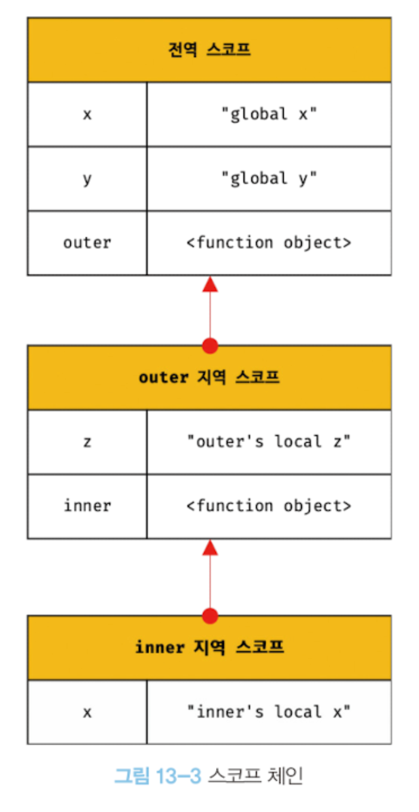

# 13장 스코프

## 13.1 스코프란?

자바스크립트의 스코프는 다른 언어의 스코프와 구별되는 특징이 있어 주의가 필요하다.  
그리고 var와 const 또는 let으로 선언한 변수의 스코프도 다르게 동작한다.  
스코프는 변수 그리고 함수와 깊은 관련이 있다. 함수의 매개변수는 함수 몸체 내부에서만 참조할 수 있고 함수 몸체 외부에서는 참조할 수 없다.

<br/>

모든 식별자(변수 이름, 함수 이름, 클래스 이름 등)는 **자신이 선언된 위치에 의해** 다른 코드가 자신을 참조할 수 있는 **유효범위가 결정된다. 이를 스코프라 한다.**

즉, 스코프는 식별자가 유효한 범위를 말한다.
또 스코프는 자바스크립트 엔진이 식별자를 검색할 때 사용하는 규칙이라고도 할 수 있다.  
(_** 코드가 어디서 실행되며 주변에 어떤 코드가 있는지를 **렉시컬 환경\*\*이라 부른다._)

<br/>

## 13.3 스코프 체인

함수는 전역에서 정의할 수도 있고 함수 몸체 내부에서 정의할 수도 있다. 함수는 중첩될 수 있으므로 함수의 지역 스코프도 중첩될 수 있다.  
이는 **스코프가 함수의 중첩에 의해 계층적인 구조를 갖는다**는 것을 의미한다.  
모든 스코프는 하나의 계층적인 구조로 연결되고, 모든 지역 스코프의 최상위 스코프는 전역 스코프이다. 이렇게 스코프가 계층적으로 연결된 것을 **스코프 체인**이라 한다.

변수를 참조할 때 자바스크립트 엔진은 **스코프 체인**을 통해 변수를 참조하는 코드의 스코프에서 시작하여, 상위 스코프 방향으로 이동하면서 선언된 변수를 검색한다. 이를 통해 상위 스코프에서 선언한 변수를 하위 스코프에서도 참조할 수 있다. **하지만 절대 상위 스코프가 하위 스코프에서 유효한 변수를 참조할 수는 없다.**

스코프 체인은 물리적으로 실제로 존재한다. 자바스크립트 엔진은 코드를 실행하기에 앞서 `렉시컬 환경`을 실제로 생성한다. 변수 선언이 실행되면 변수 식별자가 렉시컬 환경에 키로 등록되고, 변수 할당이 일어나면 변수 식별자에 해당하는 값을 변경한다. 변수의 검색도 이 렉시컬 환경(자료구조 상)에서 일어난다.


> 렉시컬 환경 : 스코프 체인은 실행 컨텍스트의 렉시컬 환경을 단방향으로 연결한 것이다. 전역 렉시컬 환경은 코드가 로드되면 곧바로 생성되고, 함수의 렉시컬 환경은 함수가 호출되면 곧바로 생성된다.

<br/>

## 13.4 함수 레벨 스코프

지역은 함수 몸체 내부를 말하고 지역은 지역 스코프를 만든다.  
이는 **코드 블록이 아닌 함수에 의해서만 지역 스코프가 생성된다는 의미이다.**

C나 자바 등을 비롯한 대부분의 언어에서는 함수 몸체만이 아니라 모든 코드 블록(if, for, while, try/catch 등)이 지역 스코프를 만든다. 이러한 특성을 **블록 레벨 스코프**라 한다.  
하지만 `var`키워드로 선언된 변수는 오로지 함수의 코드 블록만을 지역 스코프로 인정한다. 이러한 특성을 **함수 레벨 스코프**라 한다.

```
var x = 1;

if(true){
    // var 키워드로 선언된 변수는 함수의 코드 블록만을 지역 스코프로 인정한다.
    // 함수 밖에서 var 키워드로 선언된 변수는 코드 블록 내에서 선언되었다 할지라도 모드 전역변수이다.
    // 따라서 x는 전역변수이다. 이미 선언된 전역 변수 x가 있으므로 x 변수는 중복 선언된다.
    // 이는 의도치 않게 변수 값이 변경되는 부작용을 발생시킨다.
    var x = 10;
}
console.log(x) //10
```

## 13.5 렉시컬 스코프

```
var x = 1;

function foo(){
    var x = 10;
    bar();
}

function bar(){
    console.log(x);
}
foo();
bar();
```

위 예제의 실행 결과는 bar함수의 상위 스코프가 무엇인지에 따라 결정된다. 두 가지 패턴을 예측할 수 있다.

1. 함수를 어디서 호출했는지에 따라 함수의 상위 스코프를 결정한다.
2. 함수를 어디서 정의했는지에 따라 함수의 상위 스코프를 결정한다.

첫번째 방식 => bar함수의 상위 스코프는 foo함수의 지역 스코프와 전역 스코프일 것이다.=> **동적 스코프라고 함.**
두번째 방식 => bar함수의 상위 스코프는 전역 스코프일 것이다.  
프로그래밍 언어에서는 이 두가지 방법 중 한가지 방식으로 상위 스코프를 결정한다. => **렉시컬 스코프 또는 정적 스코프라고 함.**

결론 : 자바스크립트를 비롯한 대부분의 프로그래밍 언어는 `렉시컬 스코프`를 따른다.

**=> 함수의 상위 스코프는 언제나 자신이 정의된 스코프다.**
