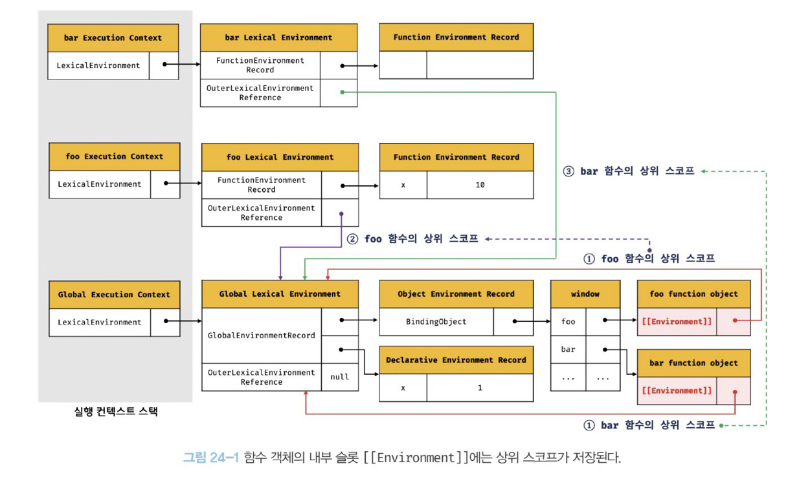

# 24장 클로저

MDN에서 설명하는 클로저는

> 클로저는 함수와 그 함수가 선언된 렉시컬 환경과의 조합이다.

라고 소개되어 있다.

<br/>

## 24.1 렉시컬 스코프

**자바스크립트 엔진은 함수를 어디서 호출했는지가 아니라 함수를 어디에 정의헀는지에 따라 상위 스코프를 결정한다. 이를 렉시컬 스코프라 한다.**

```js
const x = 1;

function foo() {
  const x = 10;
  bar();
}
function bar() {
  console.log(x);
}
foo(); //
bar(); //
```

함수의 상위 스코프는 함수를 어디서 정의했느냐에 따라 결정되므로 foo함수와 bar함수의 상위 스코프는 전역이다. 함수를 어디서 호출했는지는 상위 스코프 결정에 어떠한 영향도 주지 못한다.  
스코프의 실체는 실행 컨텍스트의 렉시컬 환경이다.  
이 렉시컬 환경은 자신의 "외부 렉시컬 환경에 대한 참조"를 통해 상위 렉시컬 환경과 연결된다.  
이것이 바로 스코프 체인이다.

<br/>

## 24.2 함수 객체의 내부 슬롯 [[Environment]]


함수는 자신의 내부 슬롯에 자신의 정의된 환경, 즉 상위 스코프의 참조를 저장한다.  
함수 객체는 내부 슬롯에 저장한 렉시컬 환경의 참조, 상위 스코프를 자신이 존재하는 한 기억한다.  
외부 렉시컬 환경에 대한 참조에는 함수 객체의 내부 슬롯에 저장된 렉시컬 환경의 참조가 할당된다.

<br/>

## 24.3 클로저와 렉시컬 환경

```js
const x = 1;

function outer() {
  const x = 10;
  const inner = function () {
    console.log(x);
  };
  return inner;
}
const innerFunc = outer();
innerFunc(); //10
```

outer함수를 호출하면 outer 함수는 중첩 함수 inner를 반환하고 생명주기를 마감한다.  
하지만 innerFunc()의 결과는 10이다.  
이처럼 외부 함수보다 중첩 함수가 더 오래 유지되는 경우 중첩 함수는 이미 생명 주기가 종료한 외부 함수의 변수를 참조할 수 있다. 이러한 중첩 함수를 **클로저**라고 부른다.

앞서 MDN이 설명한 내용이 조금이 이해가 간다.

> 자바스크립트의 모든 함수는 자신의 상위 스코프를 기억하고 함수를 어디서 호출하든 상관없이 함수는 언제나 자신이 기억하는 상위 스코프의 식별자를 참조할 수 있고 식별자에 바인딩된 값을 변경할 수 있다.

다시 돌아와 outer 함수의 실행 컨텍스트는 실행 컨텍스트 스택에서 제거되지만 outer 함수의 렉시컬 환경까지 소멸되는 것은 아니다.  
outer 함수의 렉시컬 환경은 inner 함수의 [[Envieonment]] 내부 슬롯에 의해 참조되고 있고 inner 함수는 전역 변수 innerFunc에 의해 참조되고 있으므로 가비지 컬렉션 대상이 아니다.

외부 함수 보다 더 오래 생종한 중첩함수는 외부 함수의 생존여부와 상관없이 자신이 정의된 위치에 의해 결정된 상위 스코프를 기억한다.  
이처럼 중첩 함수 inner의 내부에서는 상위 스코프를 참조할 수 있으므로 상위 스코프와 식별자를 참조할 수 있고 식별자의 값을 변경할 수 있다.

자바스크립트의 모든 함수는 상위 스코프를 기억하므로 이런적으로는 모든 함수가 클로저다.  
하지만 일반적으로 모든 함수를 클로저라고 하지 않는다.

- 상위 스코프의 어떤 식별자도 참조하지 않는 함수는 클로저가 아니다.
- 외부 함수보다 생명주기가 짧으면 클로저가 아니다.

<br/>

상위 스코프 중 필요한 변수만 참조하면 참조하고 있는 식별자만을 기억한다.

=> 이것을 클로저에 의해 참조되는 상위 스코프의 변수를 **자유 변수**라고 부른다.  
클로저는 자유 변수에 묶여 있는 함수라고 할 수 있다.

<br/>

## 24.4 클로저의 활용

**클로저는 상태를 안전하게 변경하고 유지하기 위해 사용된다.**

> 상태가 의도적으로 변경되지 않도록 상태를 안전하게 은닉하고 특정 함수에게만 상태 변경을 허용한다.

## 24.5 캡슐화와 정보 은닉

캡슐화는 객체의 상태를 나타내는 프로퍼티와 프로퍼티를 참조하고 조작할 수 있는 동작인 메서드를 하나로 묶는 것을 말한다.

> 캡슐화는 객체의 특정 프로퍼티나 메서드를 감출 목적으로 사용하기도 하는데 이를 정보은닉이라 한다.

객체의 상태가 변경되는 것을 방지해 정보를 보호하고, 객체 간의 상호 의존성, 즉 **결합도**를 낮추는 효과가 있다.

<br/>

## 24.6 자주 발생하는 실수

1. var 대신 let이나 const 키워드를 사용하자.

   > let이나 const로 사용하는 반복문은 코드 블록을 반복 실행할 때마다 새로운 렉시컬 환경을 생성하여 저장한다. (반복문의 코드르 블록 내부에서 함수 정의할 때)

2. 고차 함수 사용

> 변수와 반복문의 사용을 억제할 수 있기 때문에 오류를 줄이고 가독성을 좋게 만든다.
