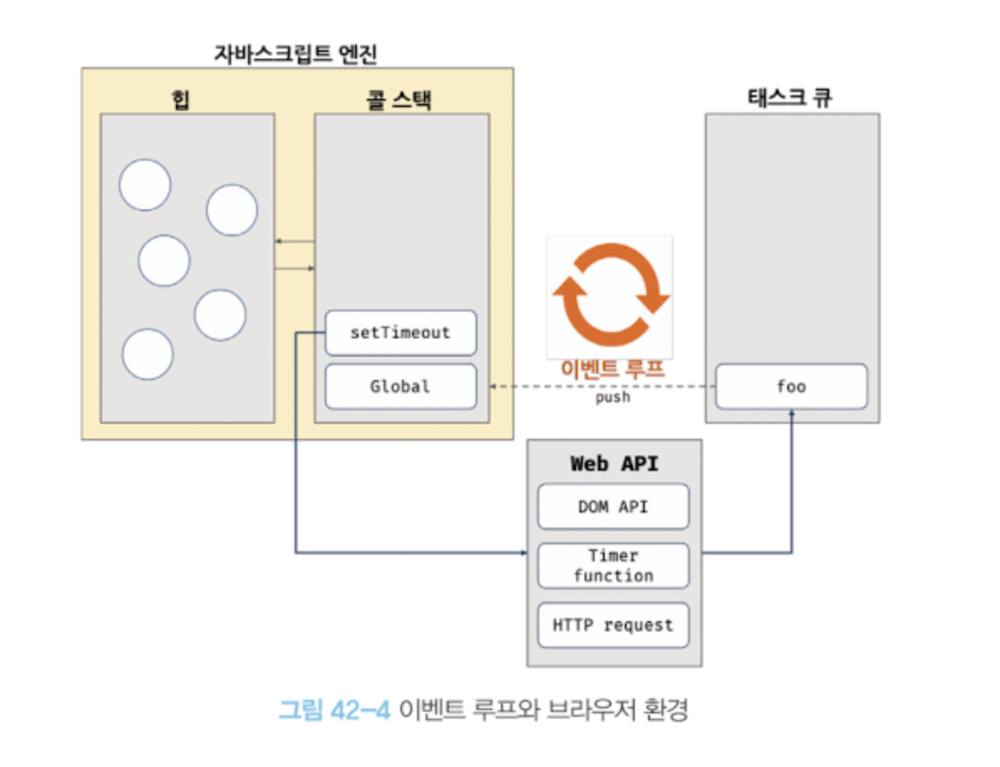

# 42장 비동기 프로그래밍

<br/>

## 42.1 동기 처리와 비동기 처리

함수를 호출하면 함수 코드가 평가되어 `함수 실행 컨텍스트`가 생성된다.  
이때 생성된 함수 실행 컨텍스트는 스택(콜 스택)이라 부른다. 이곳에 푸쉬되어 함수 코드가 실행되고 함수가 종료되면 실행 컨텍스트 스택에서 팝되어 제거된다.

<br/>

실행 컨텍스트 스택에 함수 실행 컨텍스트가 푸쉬되는 것은 바로 함수 실행의 시작을 의미한다. **함수의 실행 컨텍스트는 스택으로 관리한다.**

<br/>

**자바스크립트 엔진은 단 하나의 실행 컨텍스트 스택을 갖는다.** 이는 동시에 2개 이상의 함수를 실행할 수 없다는 것을 의미한다. 실행 컨텍스트 스택의 최사우이 요소인 `실행 중인 실행 컨텍스트`를 제외한 모든 실행 컨텍스트는 실행 대기 중인 `태스크`들이다. 현재 실행 중인 함수가 종료되면 태스크들이 실행된다.  
자바스크립트 엔진은 **싱글 스레드**방식으로 동작한다. 이 방식은 한 번에 하나의 태스크만 실행할 수 있기 때문에 처리에 시간이 걸리는 태스크를 실행하는 경우 **블로킹(작업중단)**이 발생한다.

<br/>

```
function sleep(func, delay){
    const delayUntil = Date.now() + delay;
    while(Date.now() < delayUntil);
    func();
}
function foo(){
    console.log('foo');
}
function bar(){
    console.log('bar');
}
sleep(foo, 3 * 1000);
bar();
```

위의 코드에서 `sleep`함수는 3초후에 `foo`함수를 호출한다. 이때 `bar` 함수는 `sleep`함수의 실행이 종료된 이후 호출되어야 하므로 3초 이상 호출되지 못하고 블로킹된다.  
<br/>

이처럼 현재 실행 중인 태스크가 종료할 때까지 다음에 실행될 태스크가 대기하는 방식을 **동기처리** 라고 한다.  
위의 예제를 타이머 함수인 `setTimeout`을 사용하여 수정해보면

```
setTimeout(foo, 3*1000);
bar(); //bar호출 => 3초 후 foo 호출
```

`setTimeout`함수는 `sleep`함수와 유사하게 일정 시간이 경과한 이후에 콜백함수를 호출하지만 setTimeout 함수 이후 태스크를 블로킹하지 않고 바로 실행된다. 이처럼 현재 실행 중인 태스크가 종료되지 않은 상태라 해도 다음 태스크를 곧바로 실행하는 방식을 **비동기 처리**라고 한다.

<br/>

비동기 처리를 수행하는 비동기 함수는 전통적으로 `콜백 패턴`을 사용한다. 비동기 처리를 위한 콜백 패턴은 `콜백 헬`을 발생시켜 가독성을 나쁘게 하고, 비동기 처리 중 발생한 에러의 예외 처리가 곤란하며, 여러 개의 비동기 처리를 한 번에 처리하는 데도 한계가 있다.  
타이머 함수인 `setTimout, setInterval, HTTP 요청, 이벤트 핸들러`는 비동기 처리 방식으로 동작한다. 비동기 처리는 이벤트 루프와 태스크 큐와 깊은 관계가 있다.

<br/>

## 32.2 이벤트 루프와 태스크 큐

자바스크립트의 특징 중 하나는 `싱글 스레드`로 동작하는 것인데, 브라우저가 동작하는 것을 보면 많은 태스크가 동시에 처리되는 것처럼 느껴진다.  
예를 들어, HTML 요소가 애니메이션 효과를 통해 움직이면서 이벤트를 처리하기도 하고, HTTP 요청을 통해 서버로부터 데이터를 가지고 오면서 렌더링하기도 한다. 이처럼 자바스크립트의 `동시성`을 지원하는 것이 바로 **이벤트 루프**이다.  
이벤트 루프는 브라우저에 내장되어 있는 기능 중 하나이다.  


구글의 V8 자바스크립트 엔진을 비롯한 대부분의 자바스크립트 엔진은 크게 2개의 영역으로 구분할 수 있다.

- 콜 스택 : 함수를 호출하면 실행 컨텍스트가 순차적으로 콜 스택에 푸쉬되어 순차적으로 실행된다. 최상위 실행 컨텍스트가 종료되어 콜 스택에서 제거되기 전까지는 다른 어떤 태스크도 실행되지 않는다.
- 힙 : 객체가 저장되는 메모리 공간이다. 콜 스택의 요소인 실행 컨텍스트는 힙에 저장된 객체를 참조한다. 메모리에 값을 저장하려면 메모리 공간의 크기를 알아야 하지만, 객체는 크기가 정해져 있지 않기 때문에 런타임에 결정(동적 할당)해야 한다. 따라서 힙은 구조화 되어 있지 않다는 특징이 있다.

이처럼 콜 스택과 힙으로 구성되어 있는 자바스크립트 엔진은 단순히 태스크가 요청되면 콜 스택을 통해 요청된 작업을 순차적으로 실행할 뿐이다.  
비동기 처리에서 소스코드의 평가와 실행을 제외한 모든 처리는 자바스크립트 엔진을 구동하는 환경인 브라우저 또는 Node.js가 담당한다. 예를 들어, `setTimeout`의 콜백 함수의 평가와 실행은 자바스크립트 엔진이 담당하지만 호출 스케줄링을 위한 타이머 설정과 콜백 함수의 등록은 브라우저 또는 Node.js가 담당한다. 이를 위해 브라우저 환경은 `태스크 큐`와 `이벤트 루프`를 제공한다.

- 태스크 큐 : 비동기 함수의 `콜백 함수` 또는 `이벤트 핸들러`가 일시적으로 보관되는 영역이다. 태스크 큐와는 별도로 `프로미스의` 후속 처리 메서드의 `콜백 함수`가 일시적으로 보관되는 `마이크로태스크 큐`도 존재한다.
- 이벤트 루프 : 이벤트 루프는 현재 `실행 중인 실행 컨텍스트`가 있는지, 그리고 `태스크 큐에 대기 중인 함수`가 있는지 반복해서 확인한다. **만약 콜 스택이 비어있고 태스크 큐에 대기 중인 함수가 있다면 이벤트 루프틑 순차적(FIFO)으로 태스크 큐에 대기 중인 함수를 콜 스택으로 이동시킨다. 이때 콜 스택으로 이동한 함수는 실행된다.** 즉, 태스크 큐에 일시 보관된 함수들은 비동기 처리 방식으로 동작한다.

<br/>
브라우저 환경에서 아래의 예제가 어떻게 동작하는지 살펴보자.

```
function foo(){
    console.log('foo');
}
function bar(){
    console.log('bar');
}
setTimeout(foo, 0);
bar();
```

1. 전역 코드가 평가되어 `전역 실행 컨텍스트`가 생성되고 콜 스택에 푸쉬된다.
2. 전역 코드가 실행되기 시작하여 `setTimeout 함수가 호출`된다. 이때 setTimeout 함수의 함수 실행 컨텍스트가 생성되고 `콜 스택에 푸쉬`되어 `현재 실행 중인 실행 컨텍스트`가 된다. 브라우저 Web API인 `타이머 함수`도 함수이므로 `함수 실행 컨텍스트를 생성`한다.
3. setTimeout 함수가 실행되면 `콜백 함수를 호출 스케줄링`하고 종료되어 콜 스택에서 팝된다. 이때 호출 스케줄링, 즉 타이머 설정과 타이머가 만료되면 `콜백 함수를 태스크 큐에 푸시하는 것은 브라우저의 역할`이다.
4. 브라우저가 수행하는 4-1과 자바스크립트 엔진이 수행하는 4-2는 병행 처리된다.  
   4-1. 브라우저는 타이머를 설정하고 타이머의 만료를 기다린다. 이후 타이머가 만료되면 콜백함수 foo가 태스크 큐에 푸시된다. 위의 경우에는 0이지만 실제는 **4ms이고 이 이후에 콜백 함수 foo가 태스크 큐에 푸시되어 대기하게 된다.** 이처럼 setTimeout 함수로 호출 스케줄링한 콜백 함수는 정확히 지연 시간 후에 호출된다는 보장은 없다. 지연 시간 이후에 함수가 태스크 큐에 푸시되어 대기하게 되지만 콜 스택이 비어야 호출되므로 약간의 시간차가 발생할 수 있기 때문이다.
   4-2. `bar함수`가 호출되어 함수 `실행 컨텍스트가 생성`되고 `콜 스택에 푸시`되어 `현재 실행 중인 실행 컨텍스트`가 된다. 이후 `bar 함수가 종료되어 콜 스택에서 팝`된다. 이때 브라우저가 타이머를 설정한 후 `4ms가 경과했다면 foo함수는 아직 태스크 큐에서 대기 중`이다.
5. `전역 코드 실행이 종료되고 실행 컨텍스트가 콜 스택에서 팝`된다.
6. `이벤트 루프`에 의해 `콜 스택이 비어 있음이 감지`되고 `태스크 큐에서 대기 중인 콜백 함수 foo`가 이벤트 루프에 의해 `콜 스택에 푸쉬`된다. 다시 말해, 콜백 함수 foo의 함수 실행 컨텍스트가 생성되고 콜 스택에 푸쉬되어 현재 실행 중인 실행 컨텍스트가 된다. 이후 foo 함수가 종료되어 콜 스택에서 팝된다.

이처럼 **비동기 함수인 setTimeout의 콜백 함수는 태스크 큐에 푸시되어 대기하다가 콜 스택이 비게 되면, 비로소 콜 스택에 푸시되어 실행한다.**  
`자바스크립트 엔진`이 `싱글 스레`드 방식으로 동작할 뿐, `브라우저`는 `멀티 스레드`로 동작한다.
